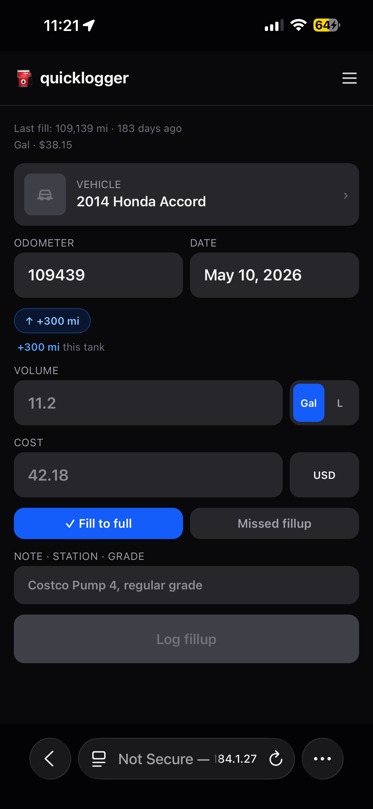
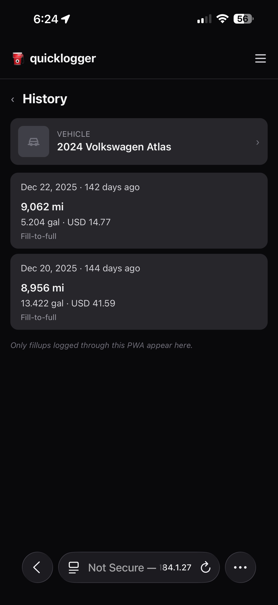
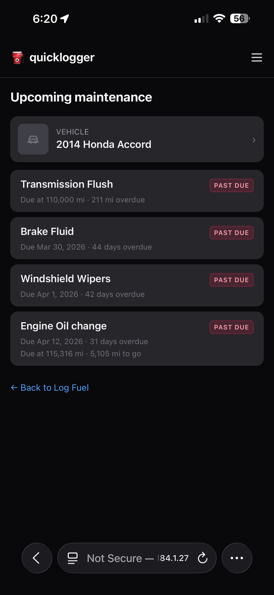
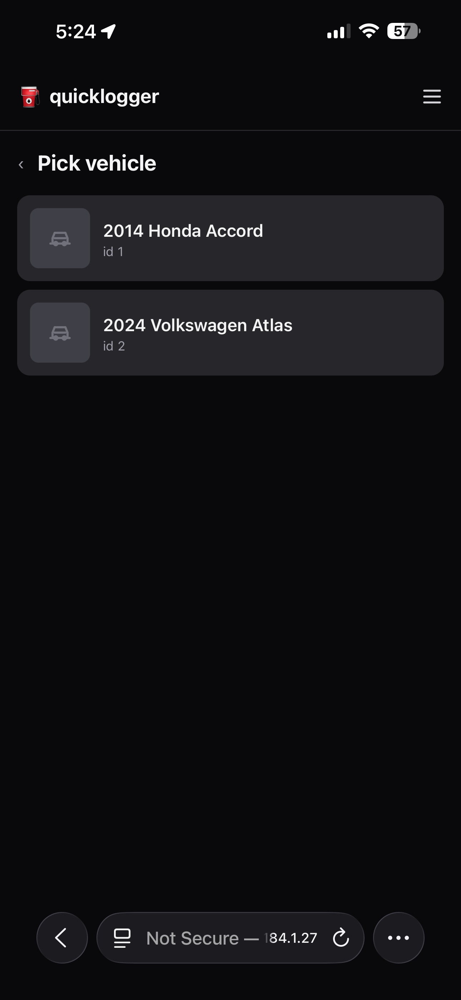
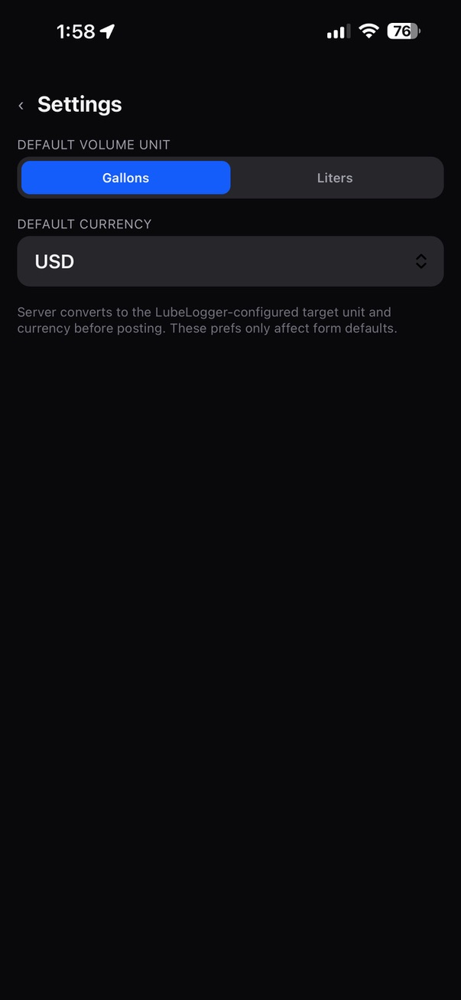
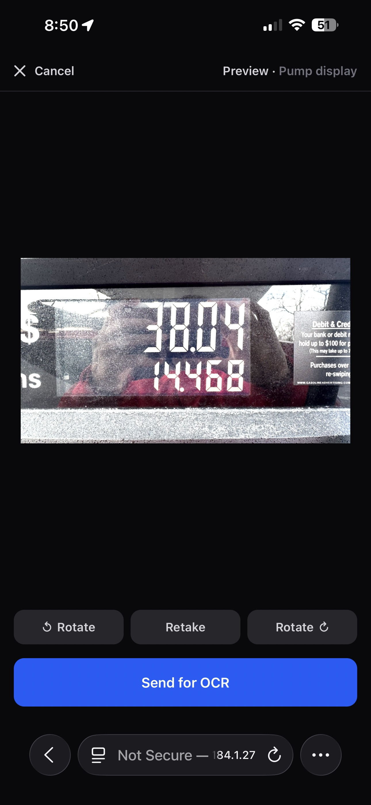

# quicklogger

Mobile-first PWA for logging fuel fill-ups to a self-hosted [LubeLogger](https://lubelogger.com) instance.

> **Status:** v0.2.10 — stable. Single-user homelab tool, daily-driven. Public repo so anyone can fork and self-host.

## Built with Claude Code

This project was developed with [Claude Code](https://claude.com/claude-code) — design, implementation, tests, infra, and docs were paired with Anthropic's coding assistant. Code is reviewed and decisions are made by a human; the assistant did the typing.

## Why

LubeLogger's web UI is great for review and analytics, but entering a fill-up at the gas pump from a phone is fiddly. quicklogger is a one-form, install-as-PWA front door optimised for the pump:

- Auto-selects the last vehicle
- Volume in gallons or liters, cost in any major currency — converted server-side
- Live MPG-since-last-fill preview as you type
- Last-fillup strip above the form + odometer prefill + one-tap `+300 mi` chip — see [`docs/user/odometer-prefill.md`](docs/user/odometer-prefill.md)
- Offline queue that auto-syncs when signal returns
- iOS Shortcut integration (voice + deep-link)
- Stays on your network — backend talks to LubeLogger over the internal Docker network, not the public internet

## Screenshots

<table>
  <tr>
    <td align="center"><strong>Log Fuel</strong></td>
    <td align="center"><strong>History</strong></td>
    <td align="center"><strong>Maintenance</strong></td>
  </tr>
  <tr>
    <td></td>
    <td></td>
    <td></td>
  </tr>
  <tr>
    <td align="center"><strong>Vehicles</strong></td>
    <td align="center"><strong>Settings</strong></td>
    <td align="center"><strong>Photo Preview</strong></td>
  </tr>
  <tr>
    <td></td>
    <td></td>
    <td></td>
  </tr>
</table>

## Quick start

The fastest path to running quicklogger — standalone container, single host, no other services on the network. Five commands:

```sh
git clone https://github.com/varunpan/quicklogger.git
cd quicklogger
cp compose.example.yml docker-compose.yml
cp .env.example .env
# Edit .env — set LUBELOGGER_URL and LUBELOGGER_API_KEY
docker compose up -d
```

quicklogger now serves on `http://localhost:3000`. Open it on your phone (same network), confirm your fleet appears under **Vehicles**, log a small dummy fill, and you're done.

For deployment behind a reverse proxy alongside an existing LubeLogger stack, see [Self-hosting](#self-hosting) below.

## Self-hosting

### Prerequisites

- Docker (any host with `docker compose`)
- A running LubeLogger instance with an **Editor**-scope API key (LubeLogger → Setup → API Keys)
- A way to expose HTTPS to the phone you'll log from (Traefik, Caddy, Cloudflare Tunnel, Tailscale Funnel, etc.). Plain HTTP works on a LAN, but iOS won't install the PWA.

### Alongside an existing LubeLogger stack

If you already run LubeLogger in a `docker compose` stack, drop quicklogger in next to it. Talking to LubeLogger over Docker DNS skips a public network round-trip:

```yaml
services:
  quicklogger:
    image: ghcr.io/varunpan/quicklogger:latest
    container_name: quicklogger
    restart: unless-stopped
    environment:
      - LUBELOGGER_URL=http://<lubelog-service>:8080  # whatever your LubeLogger service is named on this network
      - LUBELOGGER_API_KEY=${LUBELOGGER_API_KEY}   # in your stack's .env
      - LUBELOGGER_VOLUME_UNIT=gallons_us
      - LUBELOGGER_CURRENCY=USD
      - ORIGIN=https://quicklog.example.com        # your public/internal URL
      - PORT=3000
    volumes:
      - /srv/quicklogger/data:/data                # bind-mount for the FX cache
    # Runtime hardening — see docs/deployment.md § "Hardening the runtime"
    read_only: true
    tmpfs:
      - /tmp:rw,size=16m,mode=1777
    cap_drop: [ALL]
    security_opt: ["no-new-privileges:true"]
    pids_limit: 100
    mem_limit: 256m
    networks:
      - <same-network-as-lubelogger>
```

Append `LUBELOGGER_API_KEY=<key>` to the stack's `.env`. Then `docker compose up -d quicklogger` — only that service starts, the others are untouched.

### Reverse proxy

The image listens on plain HTTP `:3000`. Front it with HTTPS. Traefik label snippet (internal-only host):

```yaml
labels:
  - traefik.enable=true
  - traefik.http.services.quicklogger.loadbalancer.server.port=3000
  - traefik.http.routers.quicklogger.rule=Host(`quicklog.example.com`)
  - traefik.http.routers.quicklogger.entrypoints=websecure
  - traefik.http.routers.quicklogger.tls=true
```

For Caddy, nginx, or Cloudflare Tunnel: same idea — proxy `https://quicklog.example.com` → `http://quicklogger:3000`.

> **Set `ORIGIN` to your public URL.** SvelteKit uses it for CSRF protection on POSTs; a mismatched `ORIGIN` returns 403 on submit.

### First run

1. Open `https://quicklog.example.com` on your phone.
2. iOS: Share → Add to Home Screen.
3. Tap **☰** → **Vehicles** → confirm your fleet from LubeLogger appears.
4. Go back to **Log fillup**, enter a small dummy fill, submit. Confirm it lands in LubeLogger.

## Security posture

Defaults intended to be reasonable for a single-user homelab tool. The deeper write-up lives in [`docs/deployment.md`](docs/deployment.md) § *Hardening the runtime* — short version:

- **No app-side auth.** quicklogger has no login screen. Front it with HTTPS and either keep it on a private network (Tailscale, LAN, an internal-only hostname) or put it behind a forward-auth middleware (Authentik, Cloudflare Access, etc.).
- **CSRF / origin check.** Mutating API requests (`/api/fuelup`, `/api/ocr`, `/api/log`) are rejected with a 403 if they arrive with a browser `Origin` that doesn't match your configured `ORIGIN` — defense-in-depth beyond SvelteKit's form-only default, so a cross-site `application/json` POST is covered too. Requests with no `Origin` (Apple Shortcuts, server-to-server) are unaffected.
- **Container runs as `node` (UID 1000)**, not root.
- **Image is multi-stage** — runtime layer has only the built `build/` output, prod-only `node_modules`, and `package.json`. No build tools, no source.
- **Image is vulnerability-scanned** — every release build is scanned with Trivy and fails on fixable critical/high CVEs before it's published. The base image's OS packages are upgraded and its unused npm is stripped at build time. See [`docs/deployment.md`](docs/deployment.md) § *Vulnerability scanning*.
- **Recommended compose hardening** (in both compose patterns above): `read_only: true`, `cap_drop: [ALL]`, `security_opt: [no-new-privileges:true]`, `pids_limit: 100`, `mem_limit: 256m`, plus a 16 MB tmpfs for `/tmp`. Verified per-release.
- **Secrets surface**: `LUBELOGGER_API_KEY` (Editor-scope on your LubeLogger). Sits in `.env`, never logged. If it leaks, rotate it in LubeLogger.
- **What's still your responsibility**: rate-limiting / WAF in front (CrowdSec, Traefik middlewares); TLS cert management; network segmentation; LubeLogger's own threat model.

## Configuration

Minimum vars to run:

| Var | Required | Default | Purpose |
| --- | --- | --- | --- |
| `LUBELOGGER_URL` | yes | — | URL of your LubeLogger (use container DNS if same network) |
| `LUBELOGGER_API_KEY` | yes | — | Editor-scope API key from LubeLogger |
| `LUBELOGGER_CURRENCY` | no | `USD` | Target currency for storage |
| `ORIGIN` | no | — | SvelteKit CSRF origin (set to your public URL) |
| `PORT` | no | `3000` | App listen port |

For the full reference (every var, type, default, override scenarios), see [`docs/user/configuration.md`](docs/user/configuration.md).

### Logging

Structured JSON to stdout by default. Set `LOG_FILE_PATH` to also write a rotating logfile. Full reference in [`docs/user/configuration.md`](docs/user/configuration.md#logging-v023) and the internals in [`docs/technical/logging.md`](docs/technical/logging.md).

## Development

### Dev prerequisites

- Node 22 (pin via [`nvm`](https://github.com/nvm-sh/nvm) or [`asdf`](https://asdf-vm.com/))
- npm 10+
- A reachable LubeLogger for integration testing — any of:
  - The LubeLogger you already self-host
  - A throwaway one: `docker run --rm -p 8080:8080 ghcr.io/hargata/lubelogger:latest`

### Tech stack

The app has zero runtime npm `dependencies` — everything is `devDependencies` and gets bundled into the production artifact at build time. Exact versions live in [`package.json`](package.json); the categories below are the load-bearing pieces.

| Layer | Package | Purpose |
| --- | --- | --- |
| **Framework** | [`@sveltejs/kit`](https://kit.svelte.dev) ^2.57 | Full-stack framework (file-based routing, SSR, server endpoints) |
| | [`svelte`](https://svelte.dev) ^5.56 | UI framework (runes-mode component model) |
| | [`@sveltejs/adapter-node`](https://kit.svelte.dev/docs/adapter-node) ^5.5 | Production adapter — emits a `node build` entrypoint |
| **Build** | [`vite`](https://vite.dev) ^8.0 | Dev server + production bundler |
| | [`typescript`](https://www.typescriptlang.org) ^6.0 | Type system |
| | [`svelte-check`](https://github.com/sveltejs/language-tools/tree/master/packages/svelte-check) ^4.4 | Svelte/TS type-checker |
| **Styling** | [`tailwindcss`](https://tailwindcss.com) ^4.2 + [`@tailwindcss/vite`](https://tailwindcss.com/docs/installation/using-vite) | Utility-first CSS via Vite plugin |
| **Client state** | [`idb`](https://github.com/jakearchibald/idb) ^8.0 | Promise-based IndexedDB wrapper for the offline submission queue |
| **Unit / integration tests** | [`vitest`](https://vitest.dev) ^4.1 + [`@vitest/coverage-v8`](https://vitest.dev/guide/coverage) | Test runner + coverage |
| | [`@testing-library/svelte`](https://testing-library.com/docs/svelte-testing-library/intro/) ^5.3 + [`@testing-library/jest-dom`](https://github.com/testing-library/jest-dom) ^6.9 | Component testing + DOM matchers |
| | [`msw`](https://mswjs.io) ^2.14 | Mock LubeLogger upstream in route-handler tests |
| | [`jsdom`](https://github.com/jsdom/jsdom) ^29.1 | Browser DOM shim for Node-side unit tests |
| | [`fake-indexeddb`](https://github.com/dumbmatter/fakeIndexedDB) ^6.2 | IndexedDB shim for tests of the offline queue |
| **E2E tests** | [`@playwright/test`](https://playwright.dev) ^1.59 | Mobile-Safari profile against the production build |
| **Lint / format** | [`eslint`](https://eslint.org) ^10.3 + [`@eslint/js`](https://eslint.org/docs/latest/use/configure/configuration-files) ^10.0 | Linter (flat config) |
| | [`eslint-plugin-svelte`](https://sveltejs.github.io/eslint-plugin-svelte/) ^3.17 + [`svelte-eslint-parser`](https://github.com/sveltejs/svelte-eslint-parser) ^1.6 | Svelte ESLint integration |
| | [`typescript-eslint`](https://typescript-eslint.io) ^8.59 | TypeScript-aware ESLint rules |
| | [`prettier`](https://prettier.io) ^3.8 + [`prettier-plugin-svelte`](https://github.com/sveltejs/prettier-plugin-svelte) ^3.5 | Code formatter |
| **Runtime** | `node:22-alpine` (Docker) | Runs as the unprivileged `node` user (UID 1000) |

### Setup

```sh
git clone https://github.com/varunpan/quicklogger.git
cd quicklogger
npm install
cat > .env <<EOF
LUBELOGGER_URL=http://localhost:8080
LUBELOGGER_API_KEY=<your key>
EOF
npm run dev   # http://localhost:5173
```

### Scripts

| Command | Purpose |
| --- | --- |
| `npm run dev` | Vite dev server with hot reload (localhost only) |
| `npm run dev:lan` | Same, exposed on the LAN — for testing on a real phone |
| `npm run build` | Production build (adapter-node → `build/`) |
| `npm run preview` | Run the production build locally |
| `npm run preview:lan` | Same, exposed on the LAN — for testing the production bundle on a real phone |
| `npm test` | Vitest — unit + route handler tests |
| `npm run test:watch` | Vitest watch mode |
| `npm run test:e2e` | Playwright (mobile-Safari profile) |
| `npm run lint` | ESLint flat config |
| `npm run check` | `svelte-kit sync` + svelte-check |
| `npm run format` | Prettier across the tree |

### Testing layers

- **Vitest (unit + integration)** — `src/**/*.test.ts`. Server modules (env, currency, lubelogger client, FX cache) and SvelteKit route handlers (with MSW mocking the LubeLogger upstream) are covered here.
- **Playwright (E2E)** — `tests/e2e/*.spec.ts`. One mobile-Safari profile to match the target device. The service worker is set to `block` per-spec so Playwright route mocks aren't intercepted.

### Testing on a real phone before release

Local dev server, real phone, same WiFi:

1. Find the dev machine's LAN IP:

   ```sh
   ipconfig getifaddr en0          # macOS, Wi-Fi
   hostname -I | awk '{print $1}'  # Linux
   ```

2. Run the dev or preview server on the LAN:

   ```sh
   npm run dev:lan        # http://<lan-ip>:5173 — hot reload
   # or, to test the production bundle:
   npm run build && npm run preview:lan   # http://<lan-ip>:4173
   ```

3. On the phone (same WiFi), open `http://<lan-ip>:5173` (or `:4173`) in Safari.

**Caveats:**

- This is plain HTTP. iOS won't let you "Add to Home Screen" as a real PWA, and the service worker won't activate — so offline-queue behaviour is unverifiable this way. Use it for layout, touch interactions, form flow, and live FX preview. For PWA install + service-worker testing, deploy to a real HTTPS host.
- `LUBELOGGER_URL` in `.env` must be reachable from the dev machine. If your LubeLogger is on the same network the dev machine is on, point at it directly (`https://lubelogger.example.com`). Otherwise, run a throwaway LubeLogger locally and point at `http://localhost:8080`.
- **Don't pollute your real fuel log** — when testing against a live LubeLogger, create a dedicated `TEST – DELETE ME` vehicle and submit fillups against that. Clean it up periodically.

### Architecture pointers

**User guides:**

- [`docs/user/app-pages.md`](docs/user/app-pages.md) — tour of the four app pages (Log Fuel / Vehicles / Settings / History)
- [`docs/user/configuration.md`](docs/user/configuration.md) — full env-var reference
- [`docs/user/currency-fx.md`](docs/user/currency-fx.md) — entering cost in any currency, server-side conversion
- [`docs/user/odometer-prefill.md`](docs/user/odometer-prefill.md) — odometer prefill + last-fillup strip
- [`docs/user/offline-queue.md`](docs/user/offline-queue.md) — how offline submission and replay works from the user's side
- [`docs/user/shortcuts.md`](docs/user/shortcuts.md) — Apple Shortcuts recipes

**Technical / internals:**

- [`docs/architecture.md`](docs/architecture.md) — high-level map of modules, FX chain, state, service worker (details live in the focused docs below)
- [`docs/technical/fx-chain.md`](docs/technical/fx-chain.md) — provider chain order, cache, resolution flow
- [`docs/technical/idb-and-api.md`](docs/technical/idb-and-api.md) — full IDB schema, every HTTP endpoint enumerated, plus the LubeLogger upstream call mapping
- [`docs/technical/odometer-prefill.md`](docs/technical/odometer-prefill.md) — odometer prefill internals (state model, lifecycle, edge cases)
- [`docs/technical/offline-odometer-prefill.md`](docs/technical/offline-odometer-prefill.md) — odometer prefill behaviour while offline (cache + queue resolution)
- [`docs/technical/offline-queue.md`](docs/technical/offline-queue.md) — IDB schema, status state machine, replay path
- [`docs/technical/service-worker.md`](docs/technical/service-worker.md) — shell cache, install/activate, fetch decision tree

**Operations:**

- [`docs/deployment.md`](docs/deployment.md) — image build, CI, GHCR release, runtime hardening
- [`docs/uat.md`](docs/uat.md) — manual test plan
- [`CHANGELOG.md`](CHANGELOG.md) — release history

### Contributing

PRs welcome. The repo is small enough to read in one sitting:

1. Open an issue describing the change before large work — especially anything that touches the server ↔ LubeLogger contract or the mobile form layout.
2. Branch from `main`. Conventional-commit-style messages preferred (`feat:`, `fix:`, `chore:`, `docs:`).
3. Lint + check + test must pass locally and in CI before merge:

   ```sh
   npm run lint && npm run check && npm test && npm run build
   ```

4. Branch protection on `main` requires a green `lint-and-test` check and a PR (no direct pushes).
5. For changes that touch visible UI, run through [`docs/uat.md`](docs/uat.md) on a real phone before requesting review.

## License

MIT — see [LICENSE](LICENSE).
